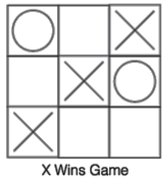
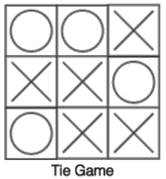

# Tic Tac Toe Game
A 3x3 grid game for 2 players

## Built With

- Visual Studio Code

## Getting Started

- run the game by typing "main" on the Command Line
- Enter your name and symbol
- Game will ask for moves alternately between the 2 players
- The player to score first 3 marks in a row (up, down, across, or diagonally) will be declared as the winner

- If none of the players score a win, the game will end in a tie/draw.

## Game Instructions
1. The game is played on a 3x3 grid.
2. One player marks with symbol X on a number, the other player with symbol O.
3. Players take turns to input a no. between (1-9) to mark one of the empty squares.
4. The first player to get 3 marks in a row (up, down, across, or diagonally) is the winner.
5. If none of the players win and all 9 squares are filled the game is a draw

## Authors

👤 **Saima**

- GitHub: [@saimaAnis21](https://github.com/saimaAnis21)
- Twitter: [@SheTALKS](https://twitter.com/SheTALKS6)
- LinkedIn: [Saima Anis](https://www.linkedin.com/in/saima-anis-3a07921b2/)

## 🤝 Contributing

Contributions, issues, and feature requests are welcome!

## Show your support

Give a ⭐️ if you like this project!

## 📝 License

Copyright 2020 Saima Anis

Permission is hereby granted, free of charge, to any person obtaining a copy of this software and associated documentation files (the "Software"), to deal in the Software without restriction, including without limitation the rights to use, copy, modify, merge, publish, distribute, sublicense, and/or sell copies of the Software, and to permit persons to whom the Software is furnished to do so, subject to the following conditions:

The above copyright notice and this permission notice shall be included in all copies or substantial portions of the Software.

THE SOFTWARE IS PROVIDED "AS IS", WITHOUT WARRANTY OF ANY KIND, EXPRESS OR IMPLIED, INCLUDING BUT NOT LIMITED TO THE WARRANTIES OF MERCHANTABILITY, FITNESS FOR A PARTICULAR PURPOSE AND NONINFRINGEMENT. IN NO EVENT SHALL THE AUTHORS OR COPYRIGHT HOLDERS BE LIABLE FOR ANY CLAIM, DAMAGES OR OTHER LIABILITY, WHETHER IN AN ACTION OF CONTRACT, TORT OR OTHERWISE, ARISING FROM, OUT OF OR IN CONNECTION WITH THE SOFTWARE OR THE USE OR OTHER DEALINGS IN THE SOFTWARE.
